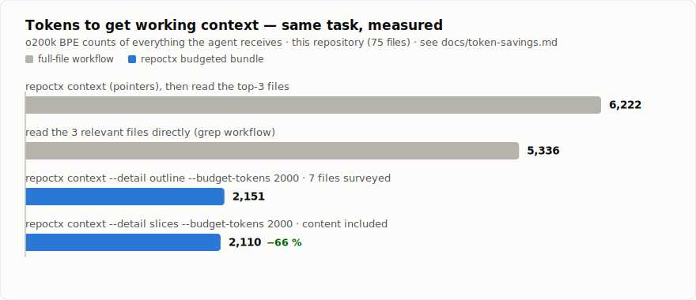

# RepoContext

> Local-first, explainable project memory for AI coding agents.

RepoContext is a local-first CLI (`repoctx`) that deterministically indexes a
software repository and gives AI coding agents compact, **explainable** context:
exactly the relevant files, symbols, tests and relationships — with a
machine-readable reason for every hit, and a hard token budget per answer.

It runs entirely offline. **No source code leaves the machine, there is no
telemetry, and no LLM or embedding calls are ever made.** The same query on the
same index always produces byte-identical output.

Supported languages: **TypeScript, TSX, JavaScript, C#**.

## Why: tokens are the bill

Every token figure repoctx reports is a real BPE count, and budgets are charged
at what the agent actually receives — so `--budget-tokens 2000` really means
about 2,000 tokens. Measured end-to-end on this repository
([methodology & full numbers](docs/token-savings.md)):

<picture>
  <source media="(prefers-color-scheme: dark)" srcset="docs/assets/token-savings-dark.svg">
  
</picture>

The loop an agent runs, on this repository:



## Requirements

- [.NET 10 SDK](https://dotnet.microsoft.com/) (LTS) to build; the released
  global tool needs only the .NET 10 runtime.

## Installation

As a .NET global tool (needs the .NET 10 runtime):

```bash
dotnet tool install --global RepoContext.Tool
repoctx --version
```

Or download a self-contained binary for `linux-x64`, `win-x64` or `osx-arm64`
(no .NET runtime required) from the [latest release][releases], unpack it and
put `repoctx` on your `PATH`:

```bash
tar -xzf repoctx-linux-x64.tar.gz     # or unzip repoctx-win-x64.zip
./repoctx --version
```

From source instead:

```bash
dotnet pack src/RepoContext.Cli -c Release
dotnet tool install --global --add-source src/RepoContext.Cli/bin/Release RepoContext.Tool
# or run directly:
dotnet run --project src/RepoContext.Cli -- <command> [options]
```

[releases]: https://github.com/Berthapp/RepoContext/releases

## Quickstart

```bash
cd your-repo
repoctx init                       # create .repoctx/ and repoctx.config.json
repoctx index                      # build the index (incremental afterwards)

repoctx search "authentication"                 # BM25 full-text search
repoctx search "login" --symbols                # search symbols only
repoctx related src/auth/login.ts               # imports, dependents, tests
repoctx context "change the login logic"        # explained, budgeted bundle
repoctx context "add logout" --top 4 --budget-tokens 2000 --snippets
repoctx architecture                            # structure, languages, centrality
```

Re-run `repoctx index` after changes — it diffs by content hash and updates only
what changed. Every command accepts `--format text|json|md`.

### Example

```
$ repoctx context "change the login logic" --top 4

Context for "change the login logic" (3 term(s)):
  1. src/auth/login.ts        0.6744  source  [L13-19]  ~166 tokens
      reasons: fts, symbol:loginUser, path-name-match, tested-by:src/auth/__tests__/login.test.ts
  2. src/auth/permissions.ts  0.4903  source  [L1-1]    ~129 tokens
      reasons: fts, symbol:Action, imported-by:src/auth/login.ts
  3. src/auth/__tests__/login.test.ts 0.2885 test [L1-18] ~171 tokens
      reasons: fts, test-of:src/auth/login.ts
  4. src/auth/session.ts      0.0920  source  [L17-23]  ~112 tokens
      reasons: imported-by:src/auth/login.ts

Budget: 4 file(s) · ~578 estimated tokens
```

### JSON output

Every command supports `--format json` for machine consumption. The contract is
stable and deterministic (snake_case keys, always `schema_version`, same input ⇒
byte-identical output). Because the JSON consumers are AI agents that pay per
token, documents are emitted **compact** — a single line, no indentation, and
null-valued optional fields (such as `heading`) omitted (ADR 0009). Pipe
through `jq` when reading as a human, or use the `text`/`md` formats. For
example (pretty-printed here for readability only):

```
$ repoctx search "login" --top 2 --format json
```

```json
{
  "schema_version": 2,
  "command": "search",
  "query": "login",
  "count": 2,
  "results": [
    {
      "path": "src/components/LoginForm.tsx",
      "kind": "source",
      "score": 2.0843,
      "start_line": 8,
      "end_line": 24,
      "chunk_kind": "symbol",
      "heading": "LoginForm",
      "reasons": ["fts"]
    },
    {
      "path": "src/auth/permissions.ts",
      "kind": "source",
      "score": 1.9299,
      "start_line": 1,
      "end_line": 1,
      "chunk_kind": "symbol",
      "heading": "Action",
      "reasons": ["fts"]
    }
  ]
}
```

`reasons` is machine-readable and explains every hit (e.g. `fts`,
`symbol:loginUser`, `imported-by:<file>`, `test-of:<file>`, `path-name-match`).
In `context` results, at most two full-path graph reasons are listed per file;
further links fold into a `graph:+N` summary (the full edge list is available
via `repoctx related`).

## Commands

| Command | Purpose | Key options |
| --- | --- | --- |
| `init` | Create `.repoctx/` and `repoctx.config.json`; add `.repoctx/` to `.gitignore`. Optionally add usage instructions to `CLAUDE.md` / `AGENTS.md`. | `--force`, `--agents`, `--no-agents` |
| `index` | Build or incrementally update the index (stores real BPE token counts per file). | `--full` |
| `search <query>` | BM25 full-text search (content and symbols). | `--top`, `--symbols`, `--format` |
| `related <file>` | Imports, dependents and linked tests of a file. | `--format` |
| `context <task>` | Ranked, explained context bundle packed into a token budget. | `--top`, `--budget-tokens`, `--detail paths\|outline\|slices`, `--known <path>@<hash>`, `--format` |
| `outline <file>` | A file's skeleton: symbols, signatures, doc summaries, exact full-read token cost. | `--format` |
| `changed` | Working-tree diff against the index, with impacted dependents. | `--format` |
| `architecture` | Structure (LOC tree), language distribution, centrality, entrypoints. | `--depth`, `--format` |
| `mcp` | Run the MCP server over stdio for AI agents (see below). | — |

Exit codes: `0` success · `1` error · `2` no index · `3` invalid arguments.

### The token-frugal loop

All token figures are real BPE counts (`o200k_base`, computed offline at index
time), so budgets can be trusted. The intended agent workflow:

1. `architecture --depth 1` — orientation for a handful of tokens.
2. `context "<task>" --detail slices --budget-tokens 2000` — working context
   with source slices packed into the budget (`--detail outline` surveys more
   files for fewer tokens; the default `paths` returns pointers plus exact
   full-read costs).
3. `outline <file>` before any full read.
4. After editing: `changed` — and `repoctx index` when it reports `stale`.
5. Echo the `hash` of files you already hold via `--known <path>@<hash>`:
   unchanged files return as zero-cost markers instead of repeated content.
   Every `context` response also carries a `state` hash that moves whenever
   the index content changes.

## Agent integration

RepoContext is agent-agnostic — any agent with shell access can use it. The
fastest way to wire it in is to let `init` write the instructions for you:

```bash
repoctx init --agents     # also create/update CLAUDE.md and AGENTS.md
```

On an interactive terminal, plain `repoctx init` asks whether to do this; pass
`--agents` to opt in without the prompt (e.g. in scripts) or `--no-agents` to
skip it. The managed block is delimited by `<!-- BEGIN/END RepoContext -->`
markers, so re-running `init` updates it in place without touching the rest of
the file or duplicating the block. Any file that already exists is appended to,
never overwritten.

Claude Code reads `CLAUDE.md`; GitHub Copilot (agent mode), Cursor and most
other agents read `AGENTS.md` — so a repository that ran `repoctx init --agents`
works with all of them out of the box. (Copilot's inline completions and
classic chat don't run tools, so RepoContext applies to agent mode only.)

To add it by hand instead, drop a snippet like this into your agent
instructions (e.g. `CLAUDE.md`, `AGENTS.md`):

```markdown
## Getting context

This repository is indexed by RepoContext (`repoctx`); token figures are real
BPE counts. The economical loop:

1. Orient once: `repoctx architecture --depth 1 --format md`.
2. Working context: `repoctx context "<task>" --detail slices --budget-tokens 2000 --format json`.
3. Before reading any file: `repoctx outline <file> --format json`.
4. Dependencies and tests: `repoctx related <file> --format json` instead of grep.
5. Find a symbol: `repoctx search "<term>" --symbols --format json`.
6. After editing: `repoctx changed --format json`; when `stale`, run `repoctx index`.
7. Never pay twice: `--known <path>@<hash>` returns unchanged files as
   zero-cost markers.
```

## MCP server

Agents that speak the [Model Context Protocol](https://modelcontextprotocol.io)
can call RepoContext directly instead of shelling out. `repoctx mcp` runs an MCP
server over stdio and exposes five read-only tools:

| Tool | Wraps | Arguments |
| --- | --- | --- |
| `repoctx.search` | `search` | `query`, `top`, `symbols` |
| `repoctx.get_context` | `context` | `task`, `top`, `budgetTokens`, `detail`, `known` |
| `repoctx.get_related_files` | `related` | `file` |
| `repoctx.get_outline` | `outline` | `file` |
| `repoctx.get_changes` | `changed` | — |

Each tool returns the same JSON as the corresponding `--format json` command
(carrying `schema_version` and per-result `reasons`). The server runs the index
from the working directory, communicates over stdin/stdout only (no network),
and never mutates the index.

Register it with an MCP-capable client, for example:

```json
{
  "mcpServers": {
    "repoctx": {
      "command": "repoctx",
      "args": ["mcp"],
      "cwd": "/path/to/your/repo"
    }
  }
}
```

With Claude Code, run this inside the repository:

```bash
claude mcp add repoctx -- repoctx mcp
```

With GitHub Copilot agent mode in VS Code, commit a `.vscode/mcp.json`:

```json
{
  "servers": {
    "repoctx": {
      "type": "stdio",
      "command": "repoctx",
      "args": ["mcp"]
    }
  }
}
```

Build the index first (`repoctx init && repoctx index`); tools return an error
until an index exists.

## Configuration

`repoctx init` writes `repoctx.config.json` (camelCase keys):

```json
{
  "include": ["src", "app", "lib", "docs"],
  "exclude": ["node_modules", "dist", "bin", "obj", ".next", ".git"],
  "respectGitignore": true,
  "sensitiveFiles": [".env*", "*.secret.*", "appsettings.Production.json"],
  "indexing": { "maxFileSizeKb": 512, "includeTests": true, "includeDocs": true },
  "ranking": {
    "weights": { "fts": 0.4, "symbol": 0.3, "graph": 0.2, "path": 0.1 },
    "synonyms": { "zahlung": ["payment", "billing"] }
  }
}
```

| Key | Meaning |
| --- | --- |
| `include` | Root directories to scan. |
| `exclude` | Directory/file globs to skip (gitignore syntax). |
| `respectGitignore` | Also honor the repository's root `.gitignore`. |
| `sensitiveFiles` | Never indexed — neither content nor path. |
| `indexing.maxFileSizeKb` | Skip files larger than this. |
| `indexing.includeTests` / `includeDocs` | Include test / documentation files. |
| `ranking.weights` | Signal weights used by `context` (fts, symbol, graph, path). |
| `ranking.synonyms` | Query-term expansions used by `context`. |

You can also add a `.repoctxignore` file (gitignore syntax) for extra
exclusions. The index (`.repoctx/`) contains code excerpts and is a sensitive
artifact; it is git-ignored automatically.

## Privacy

RepoContext never sends repository data anywhere and contains no telemetry. It
cannot stop a downstream agent from forwarding the excerpts it returns to an LLM
provider — for maximum privacy use a local/self-hosted agent and model, and list
sensitive files in `sensitiveFiles` / `.repoctxignore`.

## Troubleshooting

| Symptom | Fix |
| --- | --- |
| `No index found. Run 'repoctx index' first.` (exit code 2) | Run `repoctx init` then `repoctx index` in the repository root. |
| `File not found in index: ...` from `related` | The file is not indexed — check `include`/`exclude`, `.repoctxignore`, `sensitiveFiles` and `indexing.maxFileSizeKb`, then re-run `repoctx index`. |
| Results look stale | Re-run `repoctx index`; it is incremental and only re-reads changed files. |
| Exit code 3 | Invalid arguments — check option spelling and values (e.g. `--top` must be > 0, `--format` must be `text`, `json` or `md`). |

## Development

See `CLAUDE.md` for build/test commands, repository structure and conventions,
`docs/build-prompt.md` for the milestone plan, and `docs/decisions/` for the
architecture decision records. `docs/benchmark.md` holds the performance
benchmark protocol; `docs/token-savings.md` documents the measured end-to-end
token savings of the M6 context protocol.

### Releasing

Releases are cut by merging, not by hand:

1. Bump `<VersionPrefix>` in `Directory.Build.props` inside the feature PR
   (contract changes bump the minor version while pre-1.0).
2. Merge to `main`. The `Tag on version change` workflow notices the new
   version, pushes `v<version>`, and `release.yml` publishes to NuGet, builds
   the self-contained binaries and drafts the GitHub release.
3. Review and publish the draft release.

A merge that leaves `VersionPrefix` untouched releases nothing. One-time
setup: an Actions secret `RELEASE_PAT` (fine-grained PAT, this repository
only, Contents: Read and write) — required because tags pushed with the
default workflow token do not trigger `release.yml`.

## License

[Apache-2.0](LICENSE) — see also [NOTICE](NOTICE).
