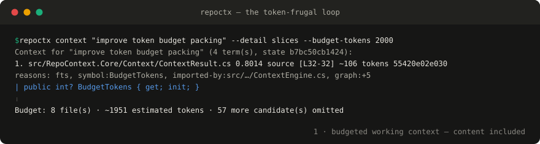

# RepoContext

> Local-first, explainable project memory for AI coding agents.

RepoContext is a local-first CLI (`repoctx`) that deterministically indexes a
software repository and gives AI coding agents compact, **explainable** context:
exactly the relevant files, symbols, tests and relationships — with a
machine-readable reason for every hit, and a hard token budget per answer.

It runs entirely offline. **No source code leaves the machine, there is no
telemetry, and no LLM or embedding calls are ever made.** The same query on the
same index always produces byte-identical output.

Supported languages: **TypeScript, TSX, JavaScript, C#**.

## Why: tokens are the bill

Every token figure repoctx reports is a real BPE count, and
`--response-budget-tokens 2000` is a hard ceiling measured against the exact
bytes emitted — not an estimate. In the current deterministic candidate
evaluation, repeating a slices request with its receipts cuts the core response
from 1,904 to 609 tokens (68%) while retaining every labelled must-find file,
symbol and span. See the [methodology, limitations and raw
artifacts](docs/token-savings.md); the candidate is a baseline for future
changes, not a retroactive pre/post quality comparison.

The loop an agent runs, on this repository:



## Requirements

- Nothing, if you install from npm: that package ships a self-contained binary.
- [.NET 10 SDK](https://dotnet.microsoft.com/) (LTS) to build; the released
  global tool needs only the .NET 10 runtime.

## Installation

From npm — no .NET runtime required, and the natural route for a
TypeScript/JavaScript repository:

```bash
npm install -g repocontext-tool
repoctx --version
```

The package is called `repocontext-tool` (mirroring the NuGet package
`RepoContext.Tool`); the command it installs is `repoctx`. Pin it per
repository instead, so the whole team gets the same version:

```bash
npm install --save-dev repocontext-tool
npx repoctx --version
```

Prebuilt binaries cover Linux (x64, arm64), macOS (Apple silicon, Intel) and
Windows (x64, arm64); npm downloads only the one that matches your machine.
Alpine and other musl-based distributions are not covered — use the .NET tool
there.

As a .NET global tool (needs the .NET 10 runtime):

```bash
dotnet tool install --global RepoContext.Tool
repoctx --version
```

Or pinned per repository as a local tool (the manifest is committed, so the
whole team gets the same version):

```bash
dotnet new tool-manifest        # once per repo, creates .config/dotnet-tools.json
dotnet tool install RepoContext.Tool
dotnet repoctx --version
```

> **Note:** `RepoContext.Tool` is a .NET *tool* — a standalone `repoctx`
> executable, not a library. Adding it to a project as a `PackageReference`
> (Visual Studio NuGet Package Manager or `dotnet add package`) fails with
> `NU1212`/`NU1213` by design. Install it with `dotnet tool install` as shown
> above — or, if you want a `PackageReference`, use `RepoContext.MSBuild`
> (next section).

### As a plain PackageReference — when `dotnet tool install` is blocked

Many corporate environments allow NuGet packages but block installing dotnet
tools. **`RepoContext.MSBuild`** delivers the same `repoctx` CLI as a regular
package: it arrives with the `dotnet restore` your build already runs — no
tool installation, no extra download, nothing outside the NuGet feed you
already trust. Add it to **exactly one project in the repository** (any target
framework; the machine needs the .NET 10 runtime, which the SDK you build with
includes):

```bash
dotnet add src/YourProject package RepoContext.MSBuild
```

Do not add it to every project through `Directory.Build.props`: auto-setup is
repository-scoped, so one project must own it.

It is a development-only dependency: nothing is compiled into your assemblies,
copied to your output, or passed on to consumers of your package. **The next
build sets everything up automatically** — no further commands:

- first build only: `repoctx init --agents` (writes `repoctx.config.json`,
  git-ignores `.repoctx/`, creates/updates the `CLAUDE.md` and `AGENTS.md`
  agent instructions);
- every build: an incremental `repoctx index`, so the index follows your
  code without anyone remembering to run it;
- a portable copy of the packaged CLI in `.repoctx/bin/tool/`, refreshed only
  when the package version changes (a one-line source stamp keeps unchanged
  builds cheap);
- wrapper scripts `repoctx` / `repoctx.cmd` in `.repoctx/bin/` (git-ignored),
  both pointing at that stable local copy;
- a `.vscode/mcp.json` registering the repoctx [MCP server](#mcp-server) for
  Copilot agent mode and other MCP clients — only when none exists yet; an
  existing `mcp.json` is never touched. It invokes the workspace-relative
  local DLL through `dotnet exec`, so the same committed file works on Windows,
  macOS and Linux.

**Install the package, build once, code with your agent** — no commands:

```bash
dotnet build      # ...and everything is ready:
./.repoctx/bin/repoctx context "change the login logic"
```

The wrapper is a fixed path for humans and agent instructions; MCP launches the
same local payload directly. The repository root is detected as: an existing
`repoctx.config.json` above the project, else the solution directory, else the
directory the build was started from — override with `-p:RepoCtxRoot=...`.

Auto-setup is skipped for IDE design-time builds, runs once per build when the
package is referenced by exactly one project (never per target framework), and
never fails your build — repoctx problems surface as warnings. Because setup
and indexing are repository-wide, separate project builds cannot share an
MSBuild critical section. Opt out per property (in the project file or via
`-p:`):
`RepoCtxAutoSetup=false` (everything), `RepoCtxAutoAgents=false` (init runs
with `--no-agents`: no `CLAUDE.md`/`AGENTS.md`), `RepoCtxAutoIndex=false`
(no per-build index), `RepoCtxAutoShim=false` (no wrapper scripts),
`RepoCtxAutoMcp=false` (no `.vscode/mcp.json`).

For manual control (e.g. with auto-setup off), four MSBuild targets remain:

```bash
# run any repoctx command through MSBuild, in the detected repository root:
dotnet msbuild src/YourProject -t:RepoCtx -p:RepoCtxArgs="index"
# refresh the repository-local portable payload:
dotnet msbuild src/YourProject -t:RepoCtxInstall
# (re)write the wrapper scripts:
dotnet msbuild src/YourProject -t:RepoCtxShim
# write .vscode/mcp.json (if missing):
dotnet msbuild src/YourProject -t:RepoCtxMcpConfig
```

Or download a self-contained binary for `linux-x64`, `linux-arm64`, `win-x64`,
`win-arm64`, `osx-x64` or `osx-arm64` (no .NET runtime required) from the
[latest release][releases], unpack it and put `repoctx` on your `PATH`:

```bash
tar -xzf repoctx-linux-x64.tar.gz     # or unzip repoctx-win-x64.zip
./repoctx --version
```

From source instead:

```bash
dotnet pack src/RepoContext.Cli -c Release
dotnet tool install --global --add-source src/RepoContext.Cli/bin/Release RepoContext.Tool
# or run directly:
dotnet run --project src/RepoContext.Cli -- <command> [options]
```

[releases]: https://github.com/Berthapp/RepoContext/releases

## Quickstart

```bash
cd your-repo
repoctx init                       # create .repoctx/ and repoctx.config.json
repoctx index                      # build the index (incremental afterwards)

repoctx search "authentication"                 # BM25 full-text search
repoctx search "login" --symbols                # search symbols only
repoctx related src/auth/login.ts               # imports, dependents, tests
repoctx context "change the login logic"        # explained, budgeted bundle
repoctx context "add logout" --top 4 --response-budget-tokens 2000 --detail slices
repoctx architecture                            # structure, languages, centrality
```

Re-run `repoctx index` after changes — it diffs by content hash and updates only
what changed. Every command accepts `--format text|json|md`.

### Example

```
$ repoctx context "change the login logic" --top 4

Context for "change the login logic" (3 term(s)):
  1. src/auth/login.ts        0.6744  source  [L13-19]  ~166 tokens
      reasons: fts, symbol:loginUser, path-name-match, tested-by:src/auth/__tests__/login.test.ts
  2. src/auth/permissions.ts  0.4903  source  [L1-1]    ~129 tokens
      reasons: fts, symbol:Action, imported-by:src/auth/login.ts
  3. src/auth/__tests__/login.test.ts 0.2885 test [L1-18] ~171 tokens
      reasons: fts, test-of:src/auth/login.ts
  4. src/auth/session.ts      0.0920  source  [L17-23]  ~112 tokens
      reasons: imported-by:src/auth/login.ts

Budget: 4 file(s) · ~578 estimated tokens
```

### JSON output

Every command supports `--format json` for machine consumption. The contract is
stable and deterministic (snake_case keys, always `schema_version`, same input ⇒
byte-identical output). Because the JSON consumers are AI agents that pay per
token, documents are emitted **compact** — a single line, no indentation, and
null-valued optional fields (such as `heading`) omitted (ADR 0009). Pipe
through `jq` when reading as a human, or use the `text`/`md` formats. For
example (pretty-printed here for readability only):

```
$ repoctx search "login" --top 2 --format json
```

```json
{
  "schema_version": 3,
  "command": "search",
  "query": "login",
  "count": 2,
  "results": [
    {
      "path": "src/components/LoginForm.tsx",
      "kind": "source",
      "score": 2.0843,
      "start_line": 8,
      "end_line": 24,
      "chunk_kind": "symbol",
      "heading": "LoginForm",
      "reasons": ["fts"]
    },
    {
      "path": "src/auth/permissions.ts",
      "kind": "source",
      "score": 1.9299,
      "start_line": 1,
      "end_line": 1,
      "chunk_kind": "symbol",
      "heading": "Action",
      "reasons": ["fts"]
    }
  ]
}
```

`reasons` is machine-readable and explains every hit (e.g. `fts`,
`symbol:loginUser`, `imported-by:<file>`, `test-of:<file>`, `path-name-match`).
In `context` results, at most two full-path graph reasons are listed per file;
further links fold into a `graph:+N` summary (the full edge list is available
via `repoctx related`).

## Commands

| Command | Purpose | Key options |
| --- | --- | --- |
| `init` | Create `.repoctx/` and `repoctx.config.json`; add `.repoctx/` to `.gitignore`. Optionally add usage instructions to `CLAUDE.md` / `AGENTS.md`. | `--force`, `--agents`, `--no-agents` |
| `integrate` | Wire RepoContext into the coding agents this repository uses (instructions, skills, project rules, MCP registration). Never touches `repoctx.config.json`. | `--client`, `--check`, `--remove`, `--inline-playbook`, `--list` |
| `guide` | Print the full usage protocol for an agent that needs it. Constant output, safe behind a cache breakpoint. | — |
| `index` | Build or incrementally update the index (stores real BPE token counts per file). | `--full` |
| `search <query>` | BM25 full-text search (content and symbols). | `--top`, `--symbols`, `--format` |
| `related <file>` | Imports, dependents and linked tests of a file. | `--format` |
| `context <task>` | Ranked, explained context bundle packed into a token budget. | `--top`, `--budget-tokens`, `--response-budget-tokens`, `--projected-read-budget-tokens`, `--detail auto\|paths\|outline\|slices`, `--seen <receipt>`, `--known <path>@<hash>`, `--session <name>`, `--strip-comments`, `--no-memory`, `--format` |
| `outline <file>` | A file's skeleton: symbols, signatures, doc summaries, exact full-read token cost. | `--format` |
| `changed` | Working-tree diff against the index, with impacted dependents. | `--patch`, `--format` |
| `prime` | Cache-stable repository primer for a cacheable prompt prefix (byte-identical for unchanged indexed content and token calibration). | `--files`, `--format` |
| `memory add <text>` | Store one agent-authored insight: a `note`, `decision` or `constraint`, optionally linked to files (hash-recorded) and scoped to a session. | `--kind`, `--file`, `--tag`, `--session`, `--format` |
| `memory search [query]` | Deterministic recall with reasons and hash-based `stale` flags; omit the query to list. | `--top`, `--kind`, `--file`, `--session`, `--stale`, `--format` |
| `memory rm <id>` | Remove one memory entry (curation). | `--format` |
| `architecture` | Structure (LOC tree), language distribution, centrality, entrypoints. | `--depth`, `--format` |
| `stats` | Token-savings dashboard aggregated from your local usage (see below). | `--format` (incl. `html`), `--open` |
| `mcp` | Run the MCP server over stdio for AI agents (see below). | — |

Exit codes: `0` success · `1` error · `2` no index · `3` invalid arguments · `4` drift (`integrate --check` only).

### The token-frugal loop

All token figures are real BPE counts (`o200k_base`, computed offline at index
time), so budgets can be trusted. The intended agent workflow:

1. Optionally run `prime` for a new, unfamiliar repository when the agent can
   keep a byte-stable primer (languages, layout, entrypoints, key files) behind
   a cache breakpoint. Skip this call for focused/familiar work or clients that
   cannot retain a cached prefix. The primer is byte-identical for unchanged
   indexed content and token calibration.
2. `context "<task>" --detail auto --response-budget-tokens 2000 --format md`
   — working context packed into a **hard** response ceiling. Markdown avoids
   JSON's escaping cost for embedded code; use JSON when a client needs to
   parse the envelope. `--strip-comments` can remove comment banners from
   slices (lossy; line ranges become approximate).

   `--detail auto` reads the shape of the task: change verbs (`fix`,
   `implement`, `refactor`, `debug`, …) return symbol-aligned source `spans`,
   survey terms (`where`, `which`, `architecture`, …) return outlines, which
   cover more files for fewer tokens. A task that is both gets spans — the
   survey half is answerable from source, the change half is not answerable
   from an outline. The rule table is deterministic and versioned (ADR 0018);
   name `slices`, `outline` or `paths` explicitly whenever you know better.
   The response reports the level it ran with, so nothing about the contract
   depends on the guess. This exists to remove one round trip: an agent that
   picks wrong pays for a useless response and then asks again.
3. Escalate only on a concrete gap: `search --symbols` when a file is missing,
   `outline <file>` when the symbol you need was not delivered, `related` for
   dependency/impact questions, and `architecture --depth 1` for unfamiliar
   boundaries.
4. After editing, use `changed --patch` for just the changed hunks. Run
   `repoctx index` and re-query when it reports `stale`.
5. Never pay twice, and never over-claim what is known: use receipts, whole-file
   assertions, or a named session as described below.
6. When `context` leaves a concrete knowledge gap, try `memory search` before
   re-deriving it (`context` already recalls matching memories automatically);
   `memory add` records a distilled finding after the work is done. See
   [Agent memory](#agent-memory-never-re-derive) below.

#### Budgets

| Option | Bounds | Hard? |
| --- | --- | --- |
| `--budget-tokens` | *charged work*: projected reads for `paths`, embedded content otherwise | compatibility cap (v2 basis) |
| `--response-budget-tokens` | exact model-visible response (CLI stdout includes its newline; MCP counts its text block) | **yes** |
| `--projected-read-budget-tokens` | full-file reads implied by delivered pointers | **yes** |

Only `--response-budget-tokens` promises a ceiling on what reaches the model.
Every supplied budget must pass; none overrides another. There is no first-item
exception — if a budget cannot fit the smallest useful response, the command
exits `3` with a deterministic `retry_budget_tokens=<n>` that is guaranteed to
fit, and emits no partial result. The retry value is intentionally conservative
rather than an exhaustively searched mathematical minimum, keeping malformed
tiny-budget requests cheap. See ADR 0016.

#### Reuse: receipts vs. full-file possession

These are **not** interchangeable, and conflating them was a real bug (ADR 0015):

- **`--seen <receipt>`** (repeatable) — each delivered pointer, span and outline
  symbol carries a `receipt`. Echoing one suppresses *exactly* that unit; every
  other part of the same file still arrives. Reused units are acknowledged in
  `reused` and never consume a `--top` slot, so echoing receipts buys new context
  rather than markers.
- **`--known <path>@<hash>`** — asserts you hold the **entire** file. Use it only
  when you actually read the whole file. The `hash` printed next to a *partial*
  result identifies the file version, not what you were sent; deriving `--known`
  from a slice or outline claims possession of lines you never received.
- **`--session <name>`** — persists reuse bookkeeping locally so clients need
  not echo receipts and hashes on every call. It preserves the same distinction:
  partial evidence must never be promoted to a whole-file possession claim.

Every `context` response carries `content_state` (which file contents are
indexed), `analysis_state` (that content plus config and producer versions),
`evidence_id` and `representation_id`.

Using a non-OpenAI model? Set `tokens.profile` (e.g. `"claude"`) in
`repoctx.config.json` so budgets and reported counts match your tokenizer —
the index keeps raw counts, so no re-index is needed when you switch.

### The token-savings dashboard

`repoctx stats` estimates the net token impact of that loop from your recorded
successful usage (CLI and MCP alike):

```text
Token savings (per-call calibrated counts, 2026-07-01 to 2026-07-14):

  calls                      42
  response tokens        31,208
  reads replaced        104,566
  net saved              73,358  (70 % of replaced reads)
```

Every successful query response records two token figures to a local log
(`.repoctx/stats.jsonl`): exact response cost and an estimate of full-file reads
made unnecessary, using the token calibration active for that call. A historical
log can therefore mix profiles if the configuration changes. Embedded spans and
non-empty outlines are credited at the
file's full-read cost. Only an explicit matching full-file `--known` assertion
can credit a reused read; span, symbol and pointer receipts receive no
speculative full-file credit because they do not prove a read was avoided.
**Net saved** is replaced reads minus response cost, summed over every recorded
call. It is an estimate, not a guaranteed lower bound:
discovery calls (`search`, `related`, `changed`, `architecture`, and
`context --detail paths`) receive no credit, while credited content assumes a
full read would otherwise have happened.
Breakdowns per command and per day (`--format md`/`json` for reports and
tooling) show where the savings come from. For a visual dashboard, run
`repoctx stats --open` — it writes a self-contained HTML page (charts, no
external resources, works fully offline) to `.repoctx/stats.html` and opens it
in your default browser; `--format html` prints the same page to stdout. There
is deliberately no localhost server: the browser renders the local file, and
RepoContext stays network-free. Set `REPOCTX_NO_STATS=1` to disable recording;
delete the log file to reset the dashboard. See ADR 0011.

### Agent memory: never re-derive

The index remembers what the code *is*; agent memory remembers what agents
*learned* about it — and both stay local, deterministic and explainable.
RepoContext never writes a memory itself (no LLM, no generated prose): an
agent deposits distilled insights, and the tool stores, recalls, explains and
stale-flags them.

```bash
repoctx memory add "JWT chosen over cookie sessions: mobile clients cannot hold cookies." \
  --kind decision --file src/auth/login.ts --tag auth
repoctx memory search "auth" --format json     # deterministic recall, with reasons
repoctx context "change the login logic"       # matching memories ride along in the bundle
```

Three shapes, one store (`.repoctx/memory.jsonl`, git-ignored like the rest
of `.repoctx/`):

- **`note`** — long-term knowledge ("PaymentService retries 3×, see `retry()`").
- **`decision`** — reasoning memory: a recorded *why*, so the next agent does
  not re-litigate it.
- **`constraint`** — an invariant or warning ("`Action` is public API — do not
  rename").
- `--session <name>` scopes an entry short-term: a scratchpad note visible
  only to calls carrying that session (it survives an agent's context-window
  compaction), while the session tracks delivered evidence receipts and only
  explicit whole-file possession assertions.

Every entry is content-addressed (re-adding updates instead of duplicating),
capped at 2,000 characters, and linked files record their content hash — when
a linked file changes, recall flags the entry `stale` with the drifted paths,
so outdated knowledge is visible instead of silently trusted. `context` folds
at most 3 matching memories into a reserve of at most a fifth of the token
budget (opt out with `--no-memory`); a repo without memories produces
byte-identical output to previous versions. The economics: a re-derived
"how does X work here" costs an outline (~1,100 tokens on this repo) to
several file reads — a recalled memory answers it for ~40-80.

## Agent integration

RepoContext is agent-agnostic — any agent with shell access can use it. Let
`integrate` wire it into whichever agents this repository already uses:

```bash
repoctx integrate            # detect the environment and write the managed files
repoctx integrate --list     # what each client would get
repoctx integrate --check    # CI-friendly drift check; writes nothing, exits 4 on drift
repoctx integrate --remove   # take the managed blocks back out
```

| Client | Detected by | Files it maintains |
| --- | --- | --- |
| `claude-code` | `.claude/`, `CLAUDE.md` | `CLAUDE.md` pointer, `.claude/skills/repocontext/SKILL.md`, `.mcp.json` |
| `cursor` | `.cursor/`, `.cursorrules` | `.cursor/rules/repocontext.mdc` (`alwaysApply: false`), `.cursor/mcp.json` |
| `copilot` | `.github/copilot-instructions.md`, `.vscode/` | `.github/copilot-instructions.md`, `.vscode/mcp.json` |
| `windsurf` | `.windsurf/` | `.windsurf/rules/repocontext.md` |
| `agents` | `AGENTS.md` (and the fallback when nothing is detected) | `AGENTS.md` |

Pick explicitly with `--client claude-code --client cursor` if detection is not
what you want.

Two properties matter. **It never touches `repoctx.config.json`** — unlike
`init --agents`, which needs `--force` on an initialized repository and would
overwrite your configuration along the way. And **it never overwrites what it
does not own**: instruction files are maintained through
`<!-- BEGIN/END RepoContext -->` markers with everything outside them preserved
byte-for-byte, and an MCP configuration file that already exists is reported and
left alone, because it may register other servers.

### Why the instructions are short

`CLAUDE.md`, `AGENTS.md` and `.github/copilot-instructions.md` are loaded into
**every** prompt of every session — including the ones RepoContext cannot help
with. So the managed block in them is a pointer of about 100 tokens: what the
tool is, the one call to start with, and where the rest lives. A test caps it at
150 tokens and asserts it stays under a third of the full protocol, so this is a
gate rather than a promise.

The full protocol — escalation rules, evidence reuse, budgets, calibration —
arrives only when a task actually needs it:

- **Claude Code, Cursor, Windsurf** get it as a skill or project rule, loaded on
  demand when its description matches the task.
- **Every other agent** runs `repoctx guide`, which prints the same text. That
  costs the protocol once per task instead of once per prompt.

Prefer the old behaviour? `repoctx integrate --inline-playbook` puts the full
protocol in the always-loaded files.

`repoctx init --agents` still writes `CLAUDE.md` and `AGENTS.md` directly, with
the same pointer block, so the two commands never fight over the region.

### Ambient evidence reuse

`--session <name>` is the cheapest reuse the tool offers: the agent echoes
nothing, so it costs no output tokens at all. Its weakness is that it has to be
remembered on every call. Set `REPOCTX_SESSION` and both the CLI and the MCP
server use it when no session is passed; an explicit `--session` still wins.

```bash
REPOCTX_SESSION=my-agent repoctx context "change the login logic" --detail auto
```

Choose a name that identifies **one** agent instance. A session records what was
delivered, so two agents sharing a name in one repository would let the second
receive reuse markers for evidence it never saw. That is why the generated MCP
configuration deliberately does not set the variable for you — only whoever
launches the agent knows how many are running.

## MCP server

Agents that speak the [Model Context Protocol](https://modelcontextprotocol.io)
can call RepoContext directly instead of shelling out. `repoctx mcp` runs an MCP
server over stdio and exposes seven non-destructive tools:

| Tool | Wraps | Arguments |
| --- | --- | --- |
| `repoctx.search` | `search` | `query`, `top`, `symbols` |
| `repoctx.get_context` | `context` | `task`, `top`, `budgetTokens`, `responseBudgetTokens`, `projectedReadBudgetTokens`, `detail`, `known`, `seen`, `session`, `stripComments`, `includeMemory` |
| `repoctx.get_related_files` | `related` | `file` |
| `repoctx.get_outline` | `outline` | `file` |
| `repoctx.get_changes` | `changed` | `patch` |
| `repoctx.memory_add` | `memory add` | `text`, `kind`, `files`, `tags`, `session` |
| `repoctx.memory_search` | `memory search` | `query`, `top`, `kind`, `file`, `session`, `stale` |

(`memory rm` is deliberately CLI-only: deleting team knowledge is curation and
stays under human supervision.)

Each tool returns the same JSON as the corresponding `--format json` command
(carrying `schema_version` and per-result `reasons`). The server runs the index
from the working directory, communicates over stdin/stdout only (no network),
and never mutates the index. Successful calls may append token counts to the
local usage ledger described above, so the tools are not advertised as strictly
read-only/idempotent at the MCP protocol level.

Register it with an MCP-capable client, for example:

```json
{
  "mcpServers": {
    "repoctx": {
      "command": "repoctx",
      "args": ["mcp"],
      "cwd": "/path/to/your/repo"
    }
  }
}
```

With Claude Code, run this inside the repository:

```bash
claude mcp add repoctx -- repoctx mcp
```

With GitHub Copilot agent mode in VS Code, commit a `.vscode/mcp.json`
(installed via `RepoContext.MSBuild`? The first build wrote this file for you
already, using the portable local payload):

```json
{
  "servers": {
    "repoctx": {
      "type": "stdio",
      "command": "dotnet",
      "args": ["exec", "${workspaceFolder}/.repoctx/bin/tool/repoctx.dll", "mcp"],
      "cwd": "${workspaceFolder}"
    }
  }
}
```

Build the index first (`repoctx init && repoctx index`); tools return an error
until an index exists.

`RepoCtxMcpConfig` never overwrites an existing user-owned file. If version
0.6.1 generated the old extensionless-shim command, delete that unchanged
generated file and rerun `RepoCtxMcpConfig`, or replace it with the
`dotnet exec` configuration above.

## Configuration

`repoctx init` writes `repoctx.config.json` (camelCase keys):

```json
{
  "include": [],
  "exclude": [".git", "node_modules", "dist", "build", "out", "bin", "obj", "target", "..."],
  "respectGitignore": true,
  "sensitiveFiles": [".env*", "*.secret.*", "appsettings.Production.json"],
  "indexing": { "maxFileSizeKb": 512, "includeTests": true, "includeDocs": true },
  "ranking": {
    "weights": { "fts": 0.4, "symbol": 0.3, "graph": 0.2, "path": 0.1 },
    "synonyms": { "zahlung": ["payment", "billing"] }
  }
}
```

| Key | Meaning |
| --- | --- |
| `include` | Directories to scan, each recursively. **Empty (the default) scans the whole repository**, so every project and subfolder below the root is indexed. Set it only to deliberately narrow the scope. |
| `exclude` | Directory/file globs to skip (gitignore syntax). A bare name like `dist` matches at any depth, so it also covers nested projects. |
| `respectGitignore` | Also honor `.gitignore` — the root one and any in subdirectories. |
| `sensitiveFiles` | Never indexed — neither content nor path. |
| `indexing.maxFileSizeKb` | Skip files larger than this. |
| `indexing.includeTests` / `includeDocs` | Include test / documentation files. |
| `ranking.weights` | Signal weights used by `context` (fts, symbol, graph, path). |
| `ranking.synonyms` | Query-term expansions used by `context`. |
| `tokens.profile` | Calibrate reported counts/budgets to a tokenizer: `o200k`/`openai` (default) or `claude`. |
| `tokens.factor` | Explicit calibration multiplier in `(0, 100]`; overrides `tokens.profile` (invalid values fall back to raw counts). |
| `pricing.inputPerMtok` | Input price per million tokens; enables the money view in `stats`. |
| `pricing.currency` | Currency label for the `stats` money view (default `USD`). |

You can also add a `.repoctxignore` file (gitignore syntax) for extra
exclusions. Both `.gitignore` and `.repoctxignore` are read per directory: a
file in a subdirectory applies to that subtree and overrides rules inherited
from above, so each project in a multi-project checkout keeps its own rules.

### Repositories with several projects

`repoctx init` at the top of a folder that holds several projects covers all of
them — there is no per-project setup. `init` reports what it found:

```
$ repoctx init
Initialized RepoContext in /work/checkouts
  wrote repoctx.config.json
  scope: the whole repository, 412 file(s) selected
  projects: 2 detected
    apps/web (node, package.json)
    services/api (dotnet, SampleApi.csproj)
```

Project detection is informational only — directories that belong to no project
(loose scripts, docs, `tools/`) are indexed just the same.

> **Upgrading from ≤ 0.7:** configurations written by an older `init` pin
> `include` to `["src", "app", "lib", "docs"]`, which is anchored at the
> repository root and therefore misses nested projects. `repoctx index` now
> warns when those roots do not exist. Delete the `include` key (or set it to
> `[]`) and re-run `repoctx index`.

The index (`.repoctx/`) contains code excerpts — and, with M9,
agent-authored memory notes about the code — so it is a sensitive artifact;
it is git-ignored automatically.

## Privacy

RepoContext never sends repository data anywhere and contains no telemetry. The
`stats` dashboard is fed by a strictly local usage log (`.repoctx/stats.jsonl`,
git-ignored, token counts and command names only — never content); nothing is
transmitted, and `REPOCTX_NO_STATS=1` disables it. RepoContext cannot stop a
downstream agent from forwarding the excerpts it returns to an LLM provider —
for maximum privacy use a local/self-hosted agent and model, and list sensitive
files in `sensitiveFiles` / `.repoctxignore`.

## Troubleshooting

| Symptom | Fix |
| --- | --- |
| `No index found. Run 'repoctx index' first.` (exit code 2) | Run `repoctx init` then `repoctx index` in the repository root. |
| `File not found in index: ...` from `related` | The file is not indexed — check `include`/`exclude`, `.repoctxignore`, `sensitiveFiles` and `indexing.maxFileSizeKb`, then re-run `repoctx index`. |
| `index` reports `files: 0`, or a project below the root is missing | An older config pins `include` to root-level directories. Remove the key (or set it to `[]`) to scan the whole repository and re-run `repoctx index`. |
| Results look stale | Re-run `repoctx index`; unchanged files are not reparsed, though the local hash/graph pass still reads the indexed corpus. |
| Exit code 3 | Invalid arguments — check option spelling and values (e.g. `--top` must be > 0, `--format` must be `text`, `json` or `md`). |

## Development

See `CLAUDE.md` for build/test commands, repository structure and conventions,
`docs/build-prompt.md` for the milestone plan, and `docs/decisions/` for the
architecture decision records. `docs/benchmark.md` holds the performance
benchmark protocol; `docs/token-savings.md` documents the measured end-to-end
token savings of the M6 context protocol.

### Releasing

Releases are cut by merging, not by hand:

1. Bump `<VersionPrefix>` in `Directory.Build.props` inside the feature PR
   (contract changes bump the minor version while pre-1.0).
2. Merge to `main`. The `Tag on version change` workflow notices the new
   version, pushes `v<version>`, and `release.yml` publishes to NuGet and npm,
   builds the self-contained binaries and drafts the GitHub release.
3. Review and publish the draft release.

A merge that leaves `VersionPrefix` untouched releases nothing. One-time
setup: an Actions secret `RELEASE_PAT` (fine-grained PAT, this repository
only, Contents: Read and write) — required because tags pushed with the
default workflow token do not trigger `release.yml`.

#### npm authentication

The npm job publishes through **trusted publishing**: npm exchanges the job's
GitHub OIDC identity for a short-lived credential, so no long-lived token is
stored in the repository and provenance is attested automatically. Register a
trusted publisher on npmjs.com for **each** of the seven packages
(`repocontext-tool` and the six platform packages, whose exact names are listed
in `npm/repocontext/lib/platform.js`),
under *Package settings → Trusted publishing*:

| Field | Value |
| --- | --- |
| Organization or user | `Berthapp` |
| Repository | `RepoContext` |
| Workflow filename | `release.yml` (filename only, not a path) |
| Environment | *(leave empty)* |

These fields are case-sensitive and must match GitHub exactly.

npm can only register a trusted publisher for a package that already exists,
so a package's **first-ever** version needs one of:

- an `NPM_TOKEN` Actions secret (granular token, read and write). The job uses
  it automatically when present, then you delete the secret and register the
  trusted publishers; or
- a one-off `npm publish` from a machine where you are logged in
  (`npm login`), which stores nothing in CI.

Both paths are supported without editing the workflow: `NPM_TOKEN` wins when
set, OIDC is used when it is absent. Publishing is skipped per package when
that exact version already exists, so re-running a release is safe.

Trusted publishing needs npm ≥ 11.5.1 on Node ≥ 22.14, which the job installs
itself. Note that `actions/setup-node` is used **without** `registry-url`: that
input writes an auth line into `.npmrc`, and any auth line makes npm take the
legacy token path and ignore OIDC.

The npm packages are assembled from the same self-contained publish output as
the release archives, by `npm/build-packages.mjs`. `Directory.Build.props` stays
the single source of the version: the builder reads `VersionPrefix` and pins
every platform package to it. To inspect what a release would publish:

```bash
node npm/build-packages.mjs --dry-run --out npm/dist   # manifests only
node --test npm/repocontext/test/platform.test.mjs     # launcher resolution
```

## License

[Apache-2.0](LICENSE) — see also [NOTICE](NOTICE).
